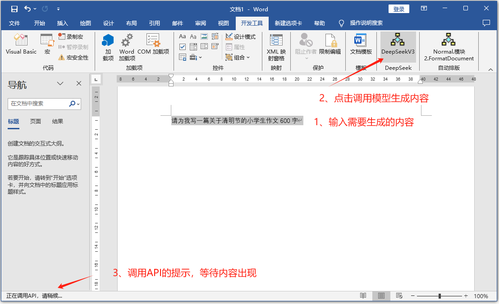
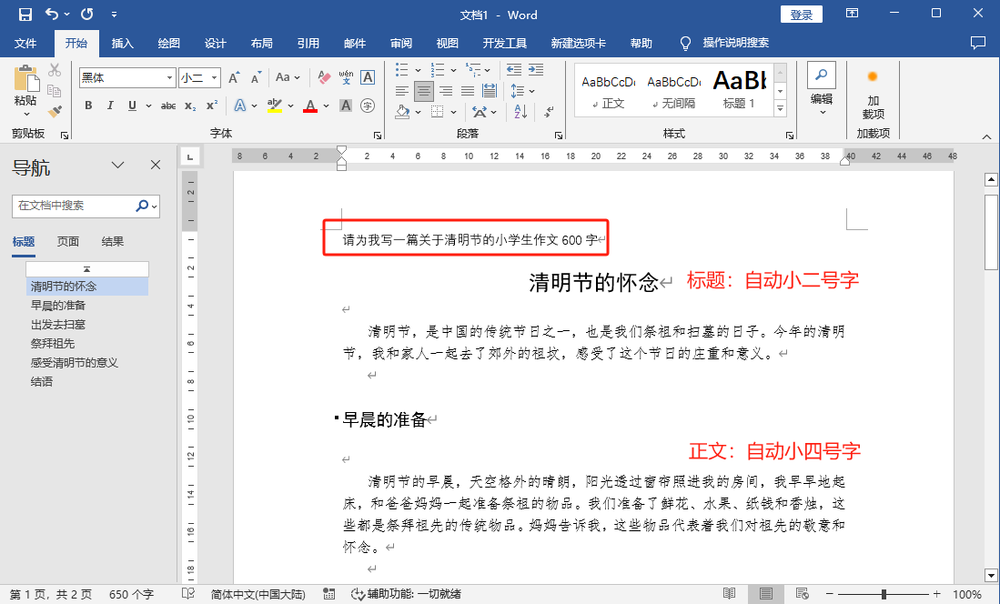

# WordGpt


# **Word AI 内容生成助手（VBA 宏脚本）**  

## **项目简介**  
本项目是一个基于 **Microsoft Word VBA** 的自动化工具，通过调用 **AI API**，帮助用户快速生成结构化文本内容（如文章、报告、大纲等），并自动应用规范的 **Markdown 格式排版**，大幅提升文档编写效率。  

## **主要功能**  
🔹 **AI 智能生成**：输入需求（如“写一篇关于 ChatGPT 的技术分析”），自动返回高质量内容。  
🔹 **一键排版**：自动解析 Markdown 语法，设置标题、列表、段落样式（字体、缩进、行距等）。  
🔹 **简单易用**：无需复杂操作，选中文本运行宏即可生成内容。  
🔹 **错误检测**：自动检查网络连接、API 密钥有效性及文本选择状态，并给出提示。  

## **适用场景**  
📌 **办公场景**：自动生成报告、会议记录、商业文档等。  
📌 **学术写作**：辅助撰写论文大纲、文献综述、技术分析。  
📌 **内容创作**：快速生成文章草稿、社交媒体文案、营销内容。  

## **使用方法**  
1. **获取 API 密钥**（免费申请：[SiliconFlow API](https://cloud.siliconflow.cn/i/CCl5Mnrb)）  
2. **在 Word 中启用宏**（`Alt+F11` 粘贴代码并保存）  
3. **选中需求文本**（如“写一篇 300 字的 AI 行业趋势分析”）  
4. **运行宏**（`Alt+F8` → 选择 `DeepSeekV3`）  

## **技术栈**  
- **开发语言**：VBA（Visual Basic for Applications）  
- **API 接口**：SiliconFlow AI（兼容 OpenAI 格式）  
- **依赖组件**：`MSXML2.ServerXMLHTTP`（Windows 内置）  

## **注意事项**  
⚠️ 需 **联网** 使用（调用外部 API）  
⚠️ 推荐使用 **Word 2016+** 或 **Microsoft 365**  
⚠️ 如需长期使用，建议申请正式 API 密钥
�
---

## 使用 Word VBA 宏自动生成内容的步骤说明

### 1. 准备工作
- **确保网络环境**：脚本需要调用外部 API（`https://api.siliconflow.cn/v1/chat/completions`），请确保您的电脑可以访问该地址。
- **安装 Word**：确保您使用的是支持 VBA 的 Microsoft Word 版本（如 Office 2016、2019 或 Microsoft 365）。
- **获取 API 密钥**：点击下列链接申请免费 API：[https://cloud.siliconflow.cn/i/CCl5Mnrb](https://cloud.siliconflow.cn/i/CCl5Mnrb)。注册并获取密钥后，将其替换脚本中的 `API_KEY` 常量（原值为 `sk-xTYifeB7vMG2mUp4111816A4C6124f8cA0Dc741528E04cDd`）。


## 图片资源
项目示例截图：
- 
- 

---

### 2. 在 Word 中启用 VBA 编辑器
1. 打开 Microsoft Word。
2. 按下快捷键 `Alt + F11`，打开 VBA 编辑器。
3. 在左侧“项目”窗口中，右键点击您的文档（例如 `VBAProject (文档1)`），选择 **插入 > 模块**。
4. 将您提供的完整 VBA 脚本代码复制并粘贴到新模块中。

---

### 3. 保存脚本
 在 VBA 编辑器中，按 `Ctrl + S` 或点击 **文件 > 保存**。

---

### 4. 配置宏运行环境
1. **启用宏**：
   - 点击 Word 菜单栏的 **文件 > 选项**。
   - 选择 **信任中心 > 信任中心设置 > 宏设置**。
   - 勾选 **启用所有宏**（仅限测试时使用，正式使用时建议选择“禁用所有宏但允许签名”并为宏签名）。
2. **检查依赖**：脚本使用 `MSXML2.ServerXMLHTTP` 对象，确保您的系统支持此组件（通常 Windows 默认支持）。

---

### 5. 使用宏生成内容
1. **输入需求文本**：
   - 在 Word 文档中输入您希望生成内容的需求（例如“写一篇关于人工智能的文章”）。
   - 用鼠标选中这段文本。
2. **运行宏**：
   - 按 `Alt + F8`，打开“宏”对话框。
   - 在列表中选择 `DeepSeekV3`（主函数名），点击 **运行**。
3. **等待生成**：
   - 状态栏会显示“正在调用 API，请稍候...”。
   - API 调用成功后，脚本会自动将返回的 Markdown 格式内容解析并插入到文档中。

---

### 6. 内容格式说明
脚本会根据 Markdown 语法自动设置格式：
- **# 主标题**：小二号黑体，18 磅。
- **## 副标题**：四号黑体，14 磅。
- **### 或 #### 三四级标题**：小四号仿宋，12 磅。
- **- 无序列表**：小四号仿宋，带项目符号。
- **1. 有序列表**：小四号仿宋，带编号。
- **普通段落**：小四号仿宋，首行缩进 2 字符（0.74 厘米），1.5 倍行距。

---

### 7. 错误处理与调试
- **API 密钥无效**：若提示“Error: Invalid API key”，检查 `API_KEY` 是否正确。
- **网络问题**：若提示“Error: Network issue”，检查网络连接或 API 地址。
- **文本未选中**：若提示“请选择需要处理的文本”，确保运行宏前已选中文本。
- **内容解析失败**：若提示“无法解析 API 返回的内容”，检查 API 返回的 JSON 格式是否符合预期。

---

### 8. 自定义修改（可选）
- **更改 API 地址**：修改 `API_URL` 常量为其他 API 地址。
- **更换模型**：修改 `MODEL_NAME` 为其他支持的模型名称（例如 `gpt-3.5-turbo`）。
- **调整字体和样式**：在 `ApplyStyle` 和 `SetLineSpacing` 函数中修改字体名称、大小或行距。

---

### 示例操作
1. 在 Word 中输入并选中文本：“请写一篇 200 字的 AI 简介。”
2. 运行 `DeepSeekV3` 宏。
3. 等待几秒后，文档中会自动插入格式化的 Markdown 内容，例如：
   ```
   # 人工智能简介
   人工智能（AI）是计算机科学的一个分支，旨在模拟人类智能。  
   ## 发展历程
   AI 起源于 20 世纪 50 年代，经过数十年的发展，已广泛应用于各领域。  
   - 机器学习：通过数据训练模型。  
   - 自然语言处理：实现人机对话。  
   人工智能正在改变我们的生活。
   ```

---
